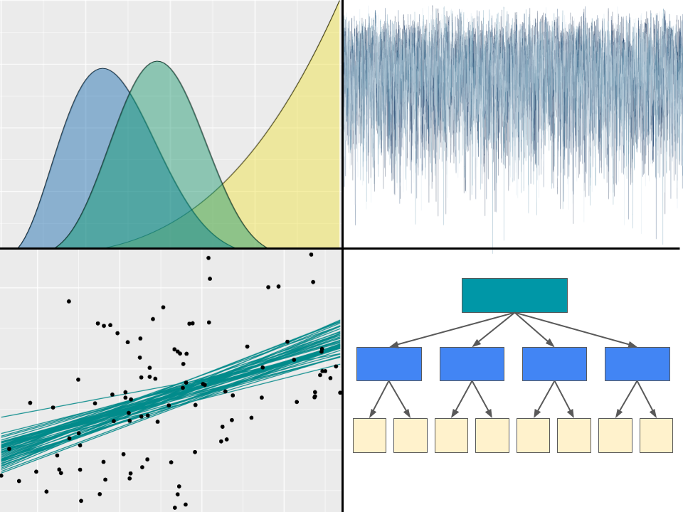
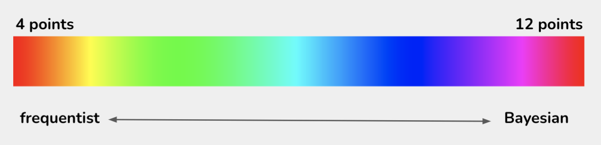

class: middle center

```{r echo=FALSE, message=FALSE}
library(tidyverse)
library(bayesrules)
library(rstanarm)
library(bayesplot)
theme_set(theme_gray(base_size = 18))
```


Mine Dogucu

University of California Irvine        

.large[`r fontawesome::fa(name = "twitter")`] <a href = "http://twitter.com/MineDogucu">MineDogucu</a>  
.large[`r fontawesome::fa(name = "github")`] <a href = "http://github.com/mdogucu">mdogucu</a>  
.large[`r fontawesome::fa(name = "link")`] <a href = "http://minedogucu.com">minedogucu.com</a>


---

class: middle center


Alicia Johnson

Macalester College

.large[`r fontawesome::fa(name = "link")`] <a href = "https://ajohns24.github.io/portfolio">Website</a>

.large[`r fontawesome::fa(name = "github")`] <a href = "https://github.com/ajohns24">ajohns24</a>  

---

class: middle center


Miles Ott

Smith College

.large[`r fontawesome::fa(name = "twitter")`] <a href = "https://twitter.com/Miles_Ott">Miles_Ott</a>   
.large[`r fontawesome::fa(name = "link")`] <a href = "https://milesott.com/">milesott.com</a>  
.large[`r fontawesome::fa(name = "github")`] <a href = "https://github.com/MilesOtt">MilesOtt</a>  


---

class: middle

### Bayes Rules! An Introduction to Bayesian Modeling with R

.center[


[`r fontawesome::fa(name = "link")`bayesrulesbook.com](https://www.bayesrulesbook.com/)
]

```{r echo=FALSE, out.width="30%", fig.align='center'}
knitr::include_graphics("img/bayes-rules-hex.png")
```


---

class: middle 

## Our Motivation

- Bayesian methods are becoming more popular

- Computing advances and reevaluation of subjectivity

- Lack of resources for the target audience (advanced undergraduate statistics/ds majors or similarly trained learners)

---

class: middle

## Pedagogical Approach

- Checking intuition 

- Active learning (quizzes and applications)

- Computing & math together

- Compute for a single case, then use built-in functions

---

class: middle

## Accessibility and Inclusion

- Open-Access

- Visual access (color-palette and alternate text)

- Citations

- Datasets

More on the topic is available on [DataPedagogy blog](https://www.datapedagogy.com/#category:Bayes_Rules!_book).
---

class: middle

## Resources

- [Undergraduate Bayesian Education Resources](https://undergrad-bayes.netlify.app/)

- [Undergraduate Bayesian Education Network](https://undergrad-bayes.netlify.app/network.html)

- [STATS 115 at UC Irvine](https://www.stats115.com)


---

class: top

## Unit Overview

.pull-left[

1: Bayesian Foundations


<hr>

2: Posterior Simulation & Analysis

<hr>


3: Regression and Classification


<hr>

4: Hierarchical Models


]

.pull-right[


```{r, out.width = "95%", echo = FALSE}

```

]


---

class: top


## Quiz yourself!


When flipping a fair coin, we say that 'the probability of flipping Heads is 0.5.' How do you interpret this probability?

a. If I flip this coin over and over, roughly 50% will be Heads.

b. Heads and Tails are equally plausible.

c. Both a and b make sense.

--


<br>


**Score yourself: a = 1, b = 3, c = 2**


---
class: top


## Quiz yourself!


A pollster claims that 'candidate A has a 0.9 probability of winning the upcoming election'. How do you interpret this probability?

a. If we observe the election over and over, candidate A will win roughly 90% of the time.

b. Candidate A is much more likely to win than to lose.    

c. The pollster's calculation is wrong. Candidate A will either win or lose, thus their probability of winning can only be 0 or 1.


--

<br>


**Score yourself: a = 1, b = 3, c = 1**


---
class: top


## Quiz yourself!


Consider two claims:

- Zuofu claims that he can predict the outcome of a coin flip.

- Kavya claims that she can distinguish natural and artificial sweeteners.

Both Zuofu and Kavya succeeded in 10 out of 10 experiments to test their claims. What do you conclude?

a. You're more confident in Kavya's claim than Zuofu's.

b. The evidence supporting Zuofu's claim is just as strong as the evidence supporting Kavya's claim.


---
class: top


## Score yourself:

a = 3, b = 1


---
class: top


## Quiz yourself!

If you tested positive for a very rare disease and only got to ask the doctor one question, which would it be?

a. What's the chance that I actually have the disease?

b. If in fact I don't have the disease, what's the chance that I would’ve gotten this positive test result?


--

<br>


**Score yourself: a = 3, b = 1**


---

class: top


## Score yourself!


```{r, out.width = "90%", echo = FALSE}

```


