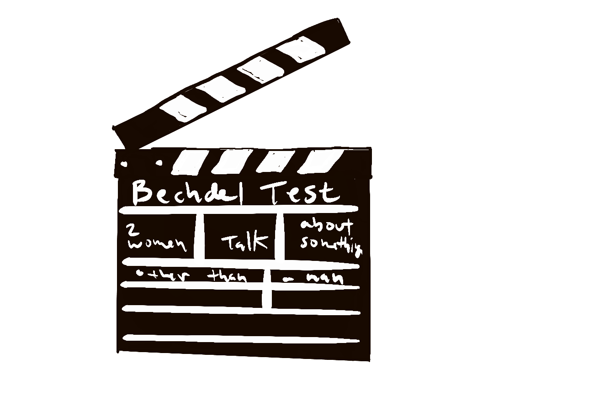

class: top 

## Bayesian Foundations Chapters

- Chapter 1. The Big (Bayesian) Picture
- Chapter 2. Bayes' Rule
- Chapter 3. The Beta-Binomial Bayesian Model
- Chapter 4. Balance and Sequentiality
- Chapter 5. Conjugate Families

---

class: top 

## By the end of this section students will be able to:

- _Think_ like a Bayesian
- Be comfortable with necessary _probability tools_
- Construct prior and likelihood and posterior models
- _Simulate Bayesian models_ in R
- Understand the _influence of the prior and data_ on the posterior
- Recognize and use common _Conjugate Families_
---

class: top 

## Thinking Like a Bayesian

.center[]

---

class: top

## Bechdel Test

.center[]

---

class: top

## Bechdel Test

Movie must have:
- Two women
- Who speak with each other
- About something other than a man

.right[]

---

class: top

## Building a Prior Distribution: Bechdel Test

--

- What proportion of movies do you think pass the Bechdel test? (chat your answer)

--

- How sure are you? Choose a range of reasonable values. (chat your answer)

--

- __Breakout rooms__: <a href = "https://github.com/bayes-rules/uscots-2021/blob/main/R/01-foundations.R">01-foundations.R</a>
- Identify a Beta distribution to formalize your prior using functions from `BayesRules` package

--

- Given some data visualize your prior, likelihood, and posterior

--

- Investigate the influence of different prior choices on your posterior

