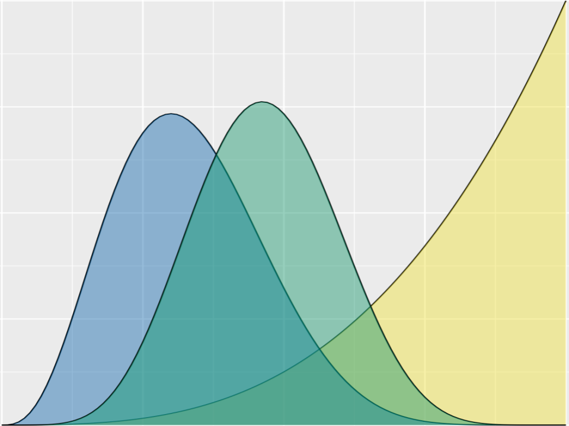
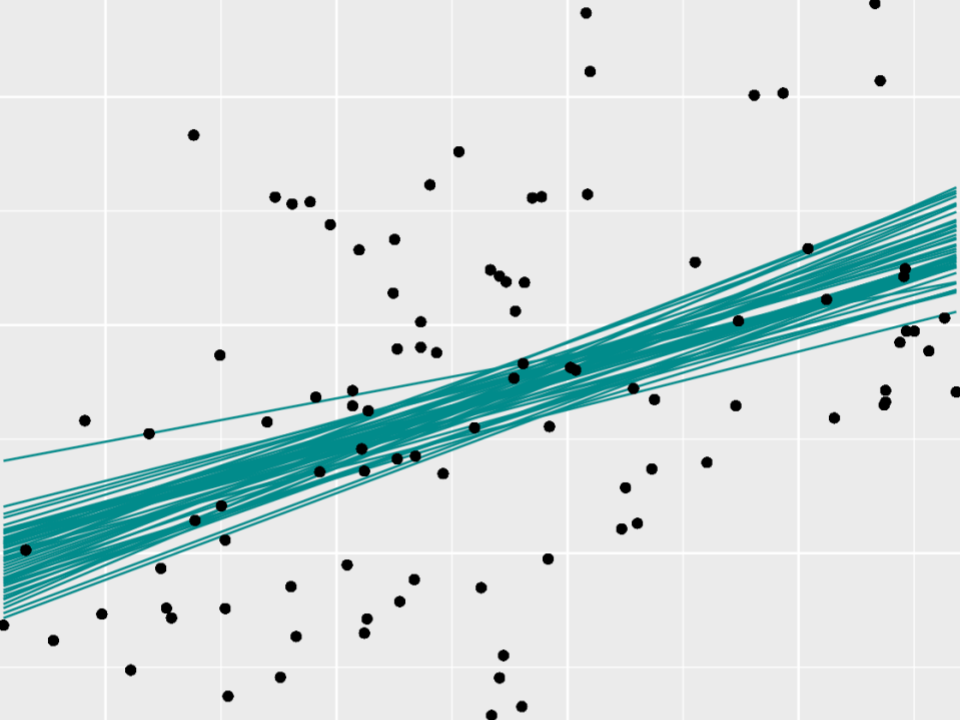

class: top

# Motivation


.pull-left[

### Unit 1

```{r, out.width = "75%", echo = FALSE, fig.align= "left"}

```


]

--

.pull-right[

### Unit 3

```{r, out.width = "75%", echo = FALSE, fig.align= "left"}

```

]


---

class: top

# The snag

The regression and classification models in Unit 3 get complicated:

$$\begin{split}
f(\beta_0,\beta_1,\sigma \; | \; \vec{y}) 
 & = \frac{\text{prior} \cdot \text{likelihood}}{ \int \text{prior} \cdot \text{likelihood}} \\
 & \\
 & = \frac{f(\beta_0) f(\beta_1) f(\sigma) \cdot \left[\prod_{i=1}^{n}f(y_i|\beta_0, \beta_1, \sigma) \right]}
 {\int\int\int f(\beta_0) f(\beta_1) f(\sigma) \cdot \left[\prod_{i=1}^{n}f(y_i|\beta_0, \beta_1, \sigma) \right] d\beta_0 d\beta_1 d\sigma} \\
 & \\
 & = \text{no thanks!} \\
 \end{split}$$
 
 

---

class: top


# Unit 2

**Chapter 6: _Approximating_ the Posterior**

How can we *approximate* a posterior using Markov chain Monte Carlo (MCMC) techniques?

--

<hr>

**Chapter 7: MCMC Under the Hood**

How does MCMC *work*?

--

<hr>

**Chapter 8: Posterior Inference and Prediction**

How can we use our approximation for inference and prediction?

---

class: top

# Activity

Let $\pi$ be the proportion of films that pass the Bechdel test. Starting with a Beta(2, 2) **prior** model for $\pi$, and **data** that 9 of 20 films passed the test, our **posterior** model of $\pi$ is Beta(11, 13):


```{r echo = FALSE, fig.width = 8, fig.height = 4}
library(bayesrules)
library(ggplot2)
plot_beta_binomial(alpha = 2, beta = 2, y = 9, n = 20) + 
  theme(text = element_text(size = 20))
```


---

class: top

# Pretend

Now **PRETEND** that we weren't able to mathematically specify our posterior. Instead we can **approximate** this posterior using a Markov chain Monte Carlo sample:


$$\left\lbrace \pi^{(1)}, \pi^{(2)}, \ldots, \pi^{(N)} \right\rbrace$$

--

- the $\pi$ values are *not independent*: $\pi^{(i)}$ depends upon $\pi^{(i-1)}$ depends upon $\pi^{(i-2)}$ depends upon...(and so on)

--

- the $\pi$ values are *not* drawn from the Beta(11, 13) posterior

--

- but *mathemagically*, when done well, the Markov chain sample will provide a reasonable *approximation* of the posterior


---

class: top


# Activity goals

- Get your hands on some MCMC samples.

- Perform some MCMC *diagnostics* (can we trust our chain?).

- Use an MCMC sample to *approximate* features of the posterior model.

- Optional: learn how to simulate a model using `rstan`

- Be patient with yourself! Many exercises require you to tap into your intuition. Solutions are there to help when wanted. 