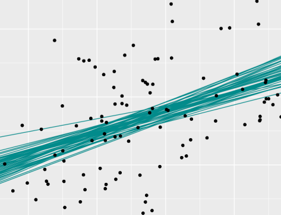
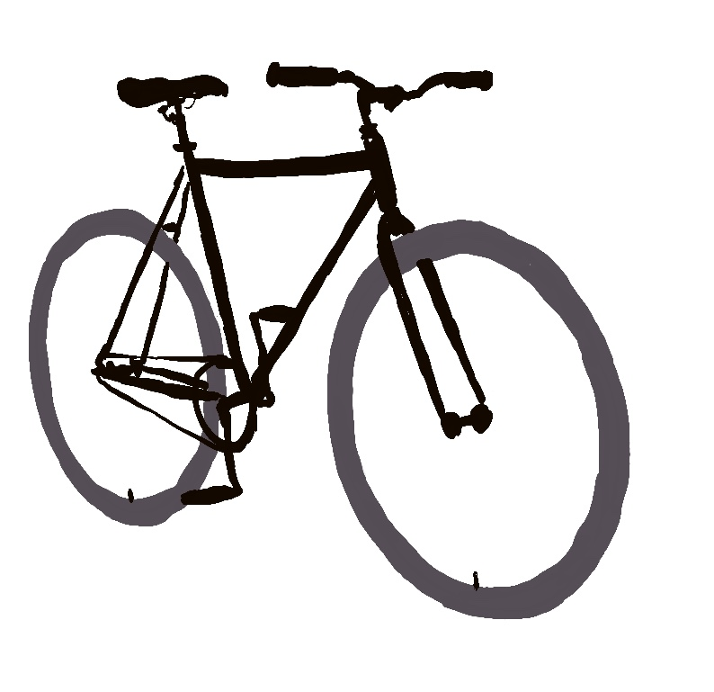

class: middle

## Models

.pull-left[

- Simple Normal Regression
- Extending the Normal Regression (multiple predictors, categorical predictors, interaction terms)
- Poisson and Negative Binomial regression
- Logistic Regression
- Naive Bayes classification
]

.pull-right[

```{r echo=FALSE, fig.align='center', out.width="80%"}

```

]

---

class: middle

## Modeling Process

- Tuning prior models
- Simulating the posterior
- Posterior prediction
- Model evaluation

---

```{r echo=FALSE, fig.align='center', out.width="40%"}

```


---


